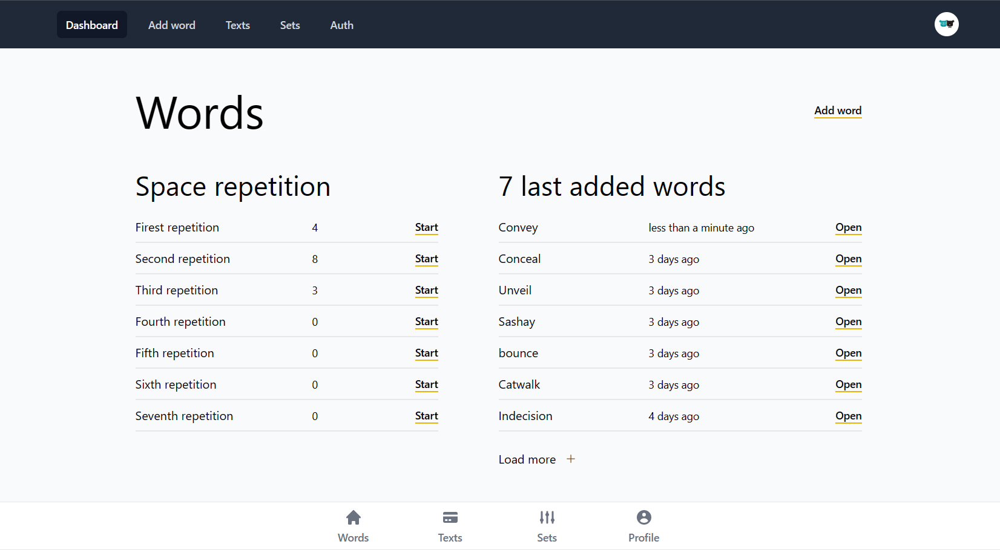
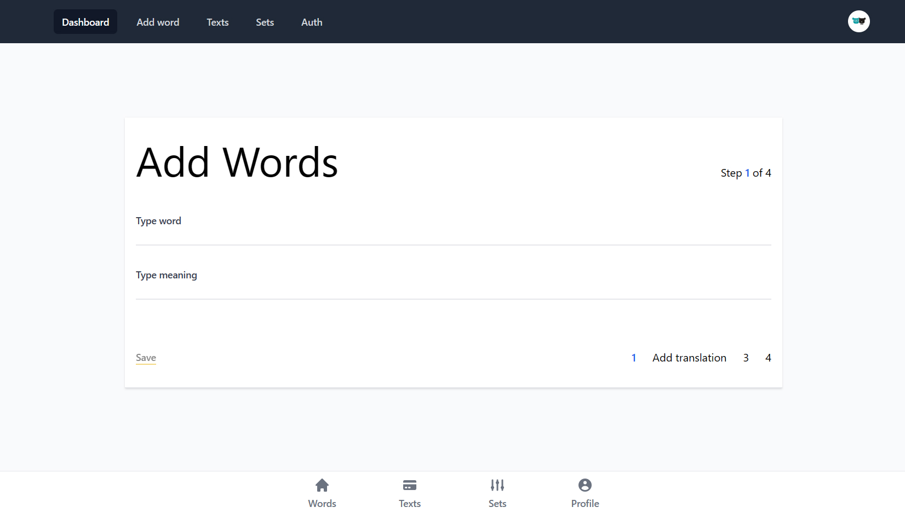
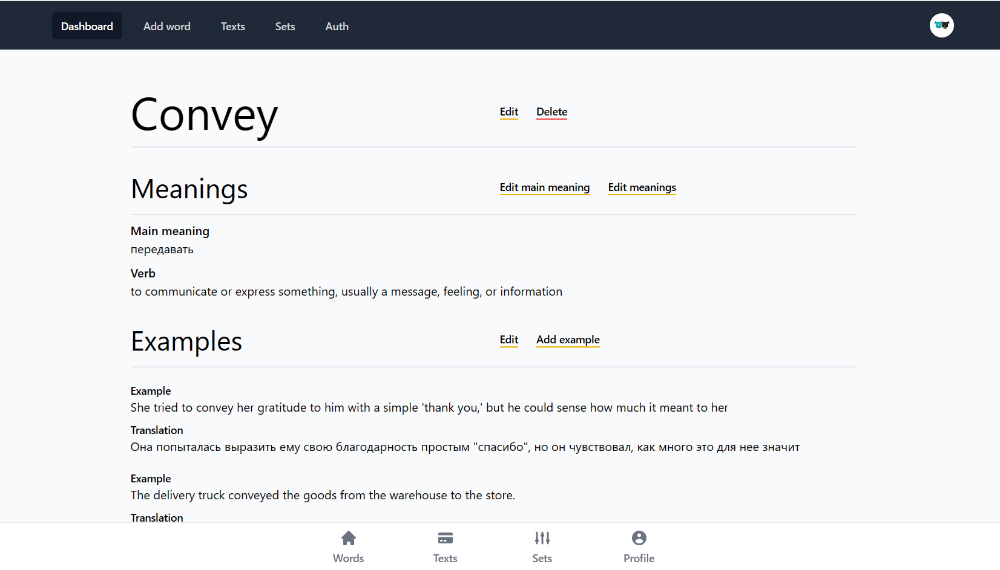
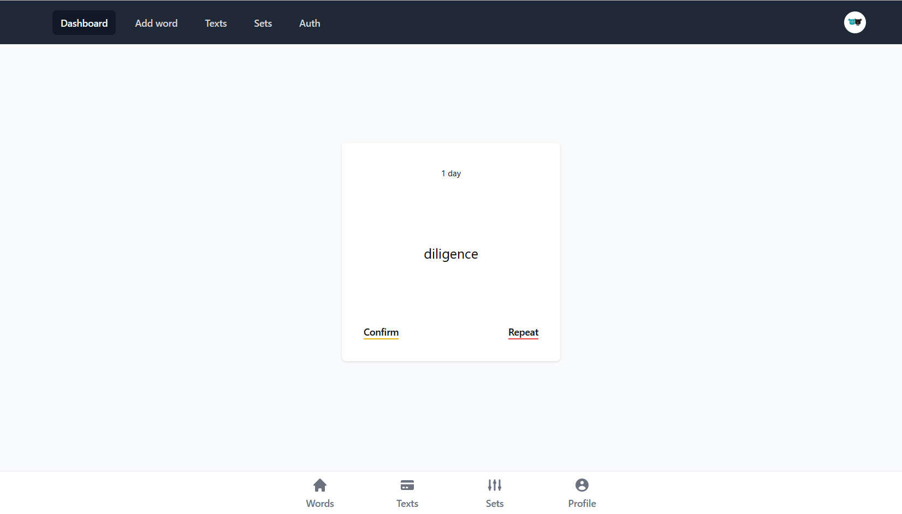
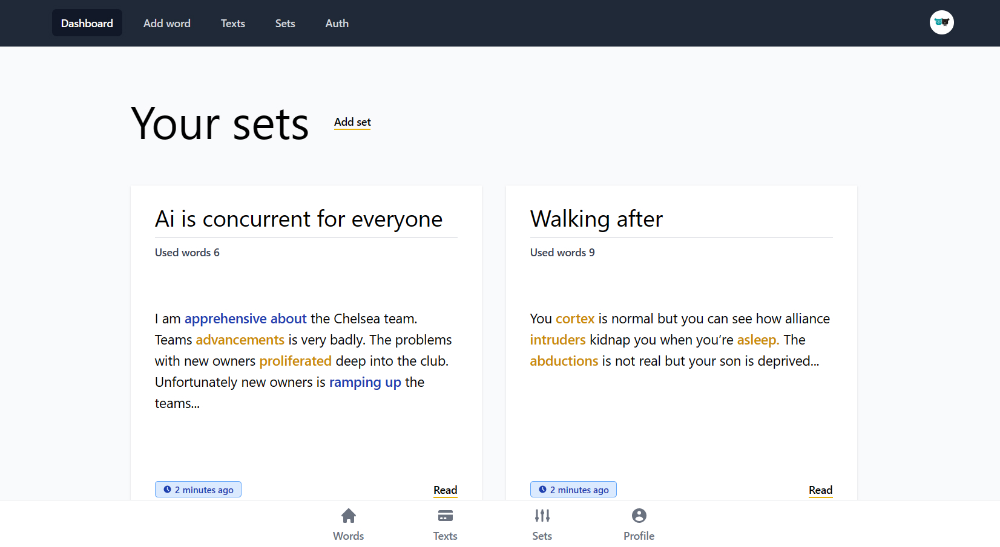
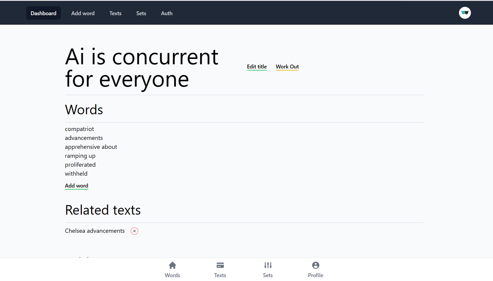
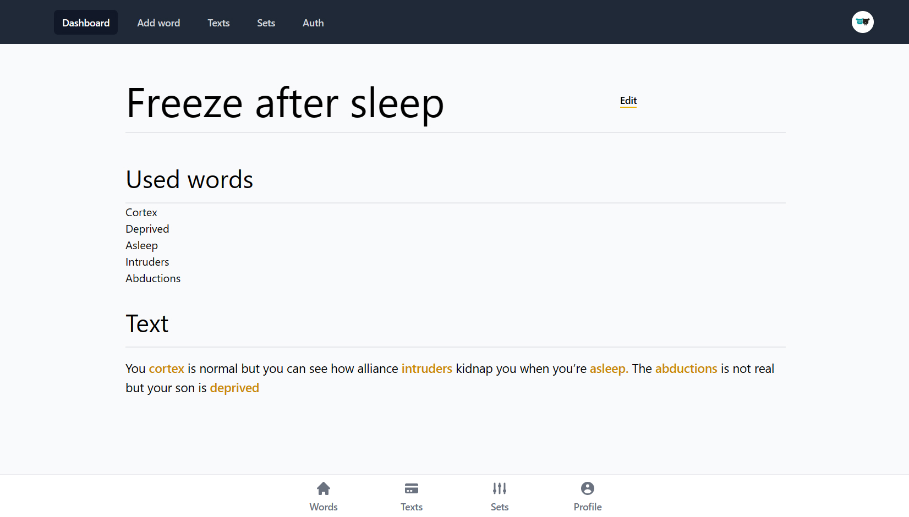

# Words Space - Boost your vocabulary online
> Live demo [_here_](https://dictionary-dca22.web.app).
> Authorization via Google

## Table of Contents
* [General Info](#general-information)
* [Technologies Used](#technologies-used)
* [Features](#features)

## General Information
I'm building my own app to improve my knowledge of modern JavaScript and help me remember English words. The app includes features like spaced repetition and text-writing exercises to make language learning more effective and engaging. I'm excited to see how this project will enhance my skills and benefit others in learning a new language.

## Technologies Used
- React  - version 18.2.0
- React-router-dom  - version 6.4.2
- Redux toolkit - version 1.9.1
- Firebase - version 9.14.0
- Framer-motion - version 9.0.4
- Jest - version 27.5.2
- Date-fns - version 2.29.3
- Tailwindcss - version 3.2.4
- Typescript - version 4.9.3

## Features
List the ready features here:
- Google authentication
- CRUD operations for words, texts, sets, and tags
- Four-step process for creating a word
- Spaced repetition for learning words
- Repetition of word sets
- Data formatting for a better user experience
- Color highlighting of simple and compound words
- Custom input validation
- Custom notifications
- Public and private routing for secure access to content

